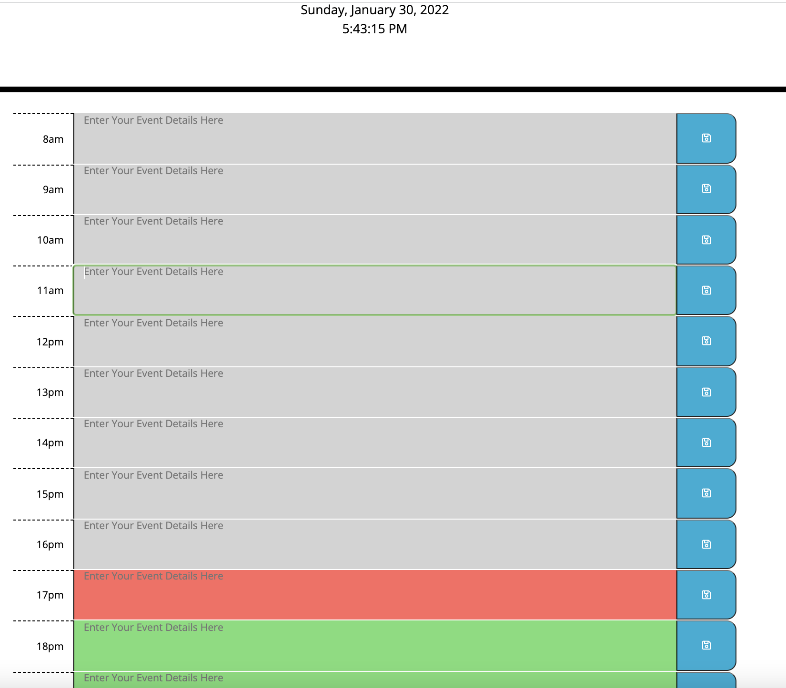

# workdayScheduler-byMakWils
https://kaylaanngrace.github.io/workdayScheduler-byMakWils/

## DESCRIPTION
My motive for this project was to gain a better understanding and enhance my javascript skills using jQuery, Bootstrap and Luxon. 

## LEARNED/LEARNING
I learned how to use jQuery, Bootstrap, and Luxon to format my JS file. Luxon was very confusing for me, the docs don't give a ton of information on formatting in Js. jQuery and bootstrap are very useful. 

## PROCESS/INSTALLTION
First, I cloned my starter code and initialized my local repo, then created and pushed it to my github remote repo. Then, I looked at my mock up and wire-framed the html page. After that, I started adding my elements and classes based off of my wire-frame and the css selectors. I also removed the moment.js script link and added luxon instead, for the date and time components. 

First, in the js file, I added a few variables to select elements from my HTML. Then I added the current date and time. To get the date and time to update without refreshing, I used a function around my DateTime variables and used setTimeout(updateDateTime, 1000). Then I added am and pm to the times. Then, I created arrays for the time and textboxes. After that, I dynamically created the time-blocks elements (time, textbox, save and delete buttons). Then I setItem and getItem to localStorage. Then I used the current hour and textbox hours to change the background colors to reflect past, future and present events. 

## USAGE
To sort events for the day by hour

## CREDITS 
how to use Luxon - https://www.youtube.com/watch?v=vAuUzEwTbck
jQuery Api Docs - https://api.jquery.com/
BootStrap Api Docs - https://moment.github.io/luxon/api-docs/index.html
Luxon Api Docs - https://moment.github.io/luxon/api-docs/index.html
jQuery Ui Api Docs - https://api.jqueryui.com/
## BUILT WITH
- HTML
- CSS
- LUXON
- JQUERY and JQUERY UI
- BOOTSTRAP

## CONTRIBUTIONS  
MADE WITH 💜 BY MAKAYLA WILSON